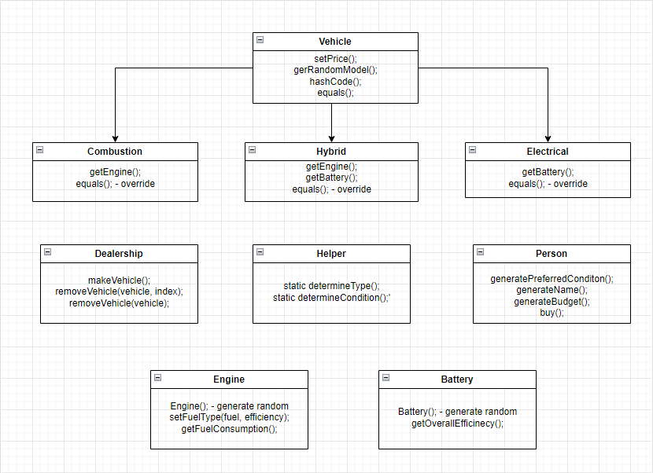

# Car Selling Simulator

The Car Selling Simulator is a comprehensive software solution designed to simulate a car dealership environment, allowing users to experience the process of buying vehicles. 
The simulator is written in Java and the main processes run on different threads to make the whole simulation smoother.


## Architecture


## Features
The simulator operates using multiple threads to simulate a complex process of creating and matching people's preferences, conditions, and budgets, as well as generating cars based on type, condition, and engine type (combustion, hybrid, electric).

In the first thread, the simulator creates individuals with specific preference types, conditions, and budgets. These attributes are stored and processed separately.

In the second thread, the simulator generates cars randomly, taking into account their type, condition, and engine type. The cars are created based on predefined parameters and are not directly influenced by the preferences of the individuals.

In the third thread, the simulator handles the buying mechanism. It compares the generated cars with the preferred type of each individual using hash codes. Hash codes are unique identifiers associated with each car and preference type. By comparing these hash codes, the simulator determines if a car matches the preferred type of the person.

By using these separate threads, the simulator efficiently manages the process of creating people with specific preferences and conditions, generating cars based on predefined parameters, and implementing a buying mechanism that compares the hash codes to determine compatibility between individuals and available cars.

## Installation
To install the application:
1. Clone the repository:
```
CMD> git clone https://github.com/Marto113/car-selling-simulation.git
```
2. Navigate to the project directory
```
CMD> cd ./car-selling-simulation
```
3. Compile the source code:
```
CMD> java Main.java
```